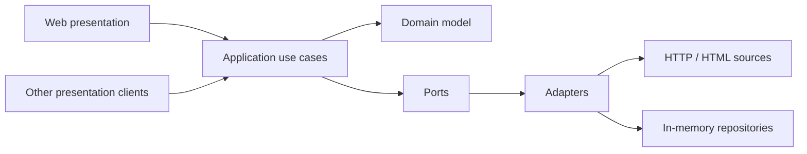
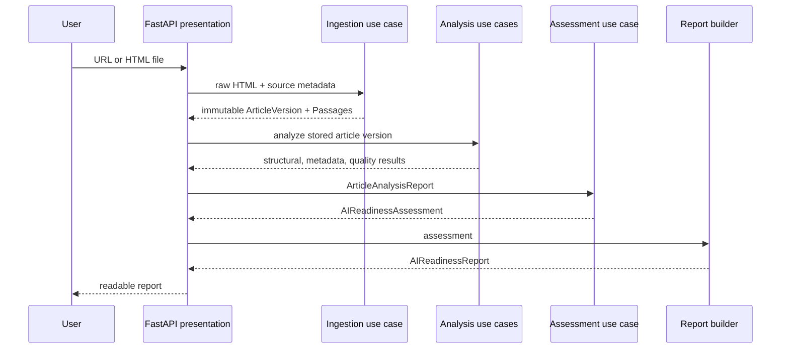

# Aether

Deterministic AI Readiness analysis for publisher articles.

Aether is an open-source MVP for examining whether an article is easy for downstream AI systems and retrieval pipelines to consume. It focuses on publisher-controlled signals: metadata completeness, article structure, and passage coverage. It deliberately does not claim to predict how a particular model will rank, quote, or answer from an article.

## What Aether does

Given a public article URL or an HTML file, Aether ingests the source as an immutable article version, extracts deterministic metadata and passages, analyzes structure, metadata, and passage quality, assesses metadata completeness, passage coverage, and structural completeness, and renders a human-readable readiness report.

The current output is qualitative (`complete`, `partial`, or `missing`) rather than a numeric score. This keeps the MVP explainable and avoids presenting an arbitrary score as a measure of model visibility.

## Current capabilities

- URL and local HTML analysis through a small FastAPI demonstration interface.
- Deterministic HTML ingestion with immutable `ArticleVersion` fingerprints.
- Passage extraction from visible HTML paragraphs.
- Deterministic publication-date precedence, including JSON-LD `datePublished`.
- Metadata extraction for title, canonical URL, dates, language, author, description, and keywords.
- Deterministic support for matching server-supplied JSON article payloads.
- Plain text, JSON, and Markdown report renderers.
- In-memory repositories suitable for the current MVP and its tests.

## Quick start

### Requirements

- Python 3.9 or newer
- A network connection when analyzing a URL

Create an environment and install the project in editable mode:

```bash
python3 -m venv .venv
source .venv/bin/activate
python -m pip install --upgrade pip
python -m pip install -e .
```

### Run the web demonstration

```bash
uvicorn aether.presentation.web.app:app --reload
```

Open <http://127.0.0.1:8000/>. Choose **Analyze a URL** for a public article, or **Upload HTML** for a saved HTML document. The interface keeps advanced fallback fields behind an expandable section and presents technical details only when requested.

### Use the application from Python

The web layer is intentionally thin. The same deterministic pipeline can be composed directly:

```python
from aether.presentation.web.app import AIReadinessPipeline

pipeline = AIReadinessPipeline()
report = pipeline.analyze_report(
    html="<html><head><title>Example</title></head><body><p>Example text.</p></body></html>",
    source_url="https://example.com/article",
    publisher="example.com",
    article_type="news_report",
)
print(report)
```

For presentation-specific output, use the renderers in `aether.presentation.ai_readiness_report_renderers`.

## Run the tests

The project uses the Python standard-library unittest runner:

```bash
python -m unittest discover -s tests -v
```

The suite covers domain invariants, ingestion, deterministic analyses, assessment/report construction, renderers, the web layer, and a happy-path acceptance fixture.

## Architecture

Aether follows a small ports-and-adapters design. Domain objects contain invariants, application use cases orchestrate workflows, adapters perform I/O, and presentation code translates an existing report for people or other consumers. Dependencies point inward: business logic does not depend on FastAPI, HTTP clients, or HTML presentation details.



The end-to-end analysis flow is:



For layer responsibilities and dependency rules, see [`docs/architecture.md`](docs/architecture.md).

## Project structure

```text
src/aether/
├── domain/                 Immutable entities and validation rules
├── application/
│   ├── ingestion/          Raw HTML registration and source snapshots
│   ├── analysis/           Structural, metadata, quality, assessment, reports
│   └── curation/           Claim candidates and evidence workflows
├── ports/outbound/         Repository and external capability contracts
├── adapters/outbound/      HTTP fetching and in-memory implementations
└── presentation/           Report renderers and FastAPI demonstration UI
tests/                      Unit, integration, and acceptance tests
docs/                       Focused extraction and architecture notes
```

## Determinism and known limitations

Aether uses only information available in the supplied HTML and explicit user fallbacks. It does not use LLMs, NLP, external enrichment, publisher-specific rules, or URL-based heuristics.

Consequently, client-side-only article bodies cannot be analyzed unless the server response includes a supported hydration payload; a local HTML file without a canonical URL needs a source URL; article type currently defaults to `news_report` in the demonstration flow; no numeric score, recommendations, claim extraction, or Schema.org graph report is part of this MVP; and publisher markup changes can affect extraction and should be captured by new deterministic fixtures and tests.

See [`docs/body-extraction.md`](docs/body-extraction.md) and [`docs/publication-date-extraction.md`](docs/publication-date-extraction.md) for the current extraction contracts.

## Roadmap

1. Improve fixture coverage across publisher layouts and malformed inputs.
2. Add persistence behind the existing repository ports.
3. Add richer provenance and curation workflows for claims and evidence.
4. Introduce deterministic structured-data analysis when the ingestion model can retain the required source representation.
5. Evaluate calibrated scoring only after outcome data and review criteria exist.
6. Add integrations for scheduled publisher monitoring and report export.

These are future directions, not promises that the current MVP already supports.

## Contributing

Changes should preserve the domain model and deterministic behavior. Add or update tests with every behavior change, keep publisher-specific logic out of generic parsing, and run the complete suite before opening a pull request. Please read the architecture notes before changing a layer boundary.

## License

Released under the [MIT License](LICENSE).
