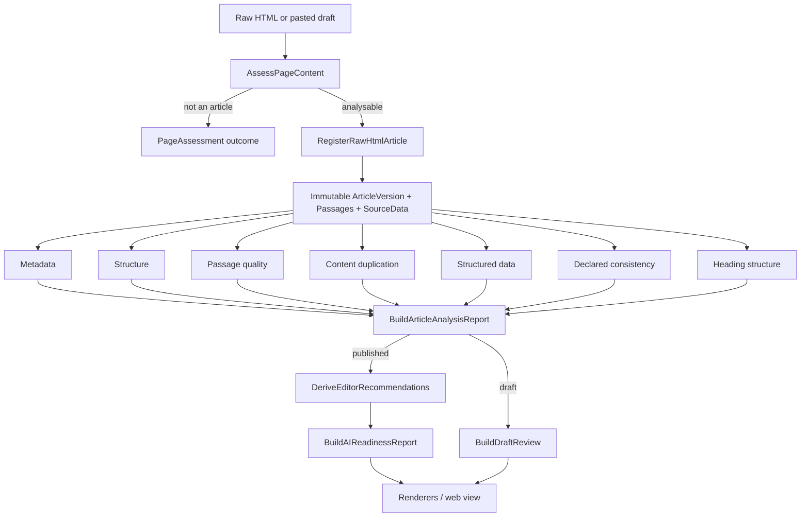

# Architecture

How the code is arranged. **Why** it is arranged this way is in
[`decisions/`](decisions/); what is currently broken or in progress is in
[`handoff.md`](handoff.md). This file describes structure only.

Aether is a deliberately small ports-and-adapters system, keeping deterministic
analysis independent of transport, storage, and presentation.

## Layers

| Layer | Responsibility | May depend on |
| --- | --- | --- |
| Domain | Immutable entities, value objects, invariants, validation | Standard library and other domain modules |
| Application | Use-case orchestration and immutable analysis results | Domain and port contracts |
| Ports | Interfaces for repositories and external capabilities | Domain types |
| Adapters | HTTP and in-memory implementations of ports | Ports, external libraries, I/O |
| Presentation | FastAPI routes, renderers, editor-facing wording | Application use cases and report types |

The dependency direction is inward. Domain code must not import FastAPI, HTTP
clients, templates, or adapters. Application use cases must not know whether a
repository is in-memory or persistent. Presentation may compose use cases, but
must not duplicate ingestion or assessment rules.

## Domain concepts

Four records carry everything the analysis reads. All are frozen dataclasses in
`domain/content.py`, immutable once created, and every one validates its own
invariants on construction.

**Article — identity, not content.** A stable identifier for one published
work; it holds no text. `article_id` is
`"article_" + sha256(canonical_source)`, so **the canonical URL is the
identity**: two requests resolving to the same canonical are the same Article.
It carries `publisher`, `canonical_source`, `original_language`,
`article_type`, `initial_published_at`, `ingested_at`, the ordered
`version_ids`, and `current_version_id`.

`article_type` is a free-text string. Nothing branches on its value except one
comparison against the literal `"draft"`, which is how drafts are excluded from
every comparison corpus.

**ArticleVersion — one immutable observation.** What the page said at one
moment: `title`, `body`, `observed_at`, plus optional `source_published_at`,
`source_updated_at`, `author`, `description` and `keywords`. Identified
`{article_id}:v{version_number}`, numbered from 1.

Its `content_fingerprint` is a SHA-256 over the JSON encoding of
`[title, body, author, description, keywords]`, so re-ingesting an unchanged
page yields the same fingerprint and creates no second version.

**`body` is required and non-empty.** This is the deepest invariant in the
system: a page from which no prose can be read cannot become an ArticleVersion
at all. The gate in front of it, and the reasoning, are
[decision 0008](decisions/0008-classify-pages-from-declared-article-nodes.md).

**Passage — one paragraph, citeable.** The unit of cross-article comparison.
`text` is one paragraph, split from the version body on blank lines;
`ordinal_position` is its zero-based index; `location_anchor` is
`paragraph:{ordinal_position + 1}`. Identified
`{article_version_id}:p{ordinal_position}`.

Its `content_fingerprint` is a SHA-256 over the paragraph text alone. **That
exact hash is what duplicate detection matches on** — nothing else is compared.

**Section — derived, never stored.** There is no Section record and no section
is persisted. A section is computed on demand in `analyze_passage_readiness.py`
from `DeclaredHeading.body_position`, which records how many body paragraphs
preceded a heading in the source markup. A heading owns the passages between its
own position and the next heading's; paragraphs before the first heading form a
section with no heading.

Two consequences are permanent rather than provisional. Sections exist only for
an article ingested from HTML, because only the parser observes the ordering — a
snapshot assembled without positions reports every heading at zero. And section
membership is a fact about markup, not about meaning: an article whose headings
sit in the wrong places produces sections that faithfully report those places.

**Publisher — a grouping key, not an entity.** There is no Publisher record. It
is a free-text `str` field on Article. When a caller supplies none, presentation
derives it from the source URL's hostname with a leading `www.` removed. It has
no hierarchy and does not model a publisher's properties, brands or channels.
Every corpus-scoped operation — the comparison count and the fingerprint
lookup — is scoped by **exact string equality** on this field, with drafts
excluded.

## Package map

```text
aether/
├── domain/
│   ├── content.py              Article, ArticleVersion, Passage
│   └── source_data.py          What a page declared to machines
├── application/
│   ├── ingestion/
│   │   ├── register_raw_html_article.py   HTML to a normalized snapshot
│   │   ├── register_source_snapshot.py    Snapshot to immutable records
│   │   ├── assess_page_content.py         Whether a page can be analysed at all
│   │   └── prepare_draft.py               Pasted text to something ingestible
│   └── analysis/               Measurements, and the advice derived from them
├── ports/outbound/
│   └── content_repository.py
├── adapters/outbound/
│   ├── http_html_fetcher.py
│   └── in_memory_content_repository.py
└── presentation/
    ├── ai_readiness_report_renderers.py   Plain text, JSON, Markdown
    ├── editor_recommendation_text.py      Wording per recommendation code
    ├── draft_check_text.py                Wording per draft check code
    ├── page_outcome_text.py               Wording for a page that could not be analysed
    └── web/                               FastAPI app and the served page
```

### Dormant modules

`domain/knowledge.py`, `domain/evaluation.py`, `domain/policies.py`,
`domain/claim_candidate.py`, `domain/claim_candidate_evidence.py`,
`application/curation/`, `ports/outbound/claim_candidate*.py` and
`adapters/outbound/in_memory_claim_candidate*.py` implement a claim-and-evidence
knowledge model from the project's first two commits.

They are **unreachable from the application** — nothing outside `tests/test_domain.py`
imports them, and they have not changed since `f751bc3`. They are documented here
so they are not mistaken for live architecture. Whether they are dead or deferred
is undecided; see [`product-discovery.md`](product-discovery.md).

### The analysis layer

Each module measures one thing and returns an immutable result. None of them
decides what to advise.

```text
analyze_article_metadata.py      Which metadata fields the page carries
analyze_article_structure.py     Size of the stored article
analyze_passage_quality.py       Per-paragraph detail
analyze_passage_readiness.py     How the article divides, and what each part states alone
passage_sentence_rules.py        Sentence rules: definitions, and ties to nearby text
analyze_content_duplication.py   Text shared with the publisher's other articles
analyze_declared_consistency.py  Whether declared titles and summaries agree
analyze_heading_structure.py     The outline the article declares
analyze_structured_data.py       What the page declares to Schema.org
declared_text_comparison.py      Rules for comparing declared values
build_article_analysis_report.py Composes the above
assess_ai_readiness.py           Metadata completeness classification
derive_editor_recommendations.py Turns measurements into recommendation codes
build_draft_review.py            The same, for an unpublished draft
build_ai_readiness_report.py     Projects it all for presentation
```

## Where advice is decided, and where it is worded

`derive_editor_recommendations.py` is the single place a measurement becomes
advice; `build_draft_review.py` is its equivalent for drafts. Both emit a
*code*, a category naming who can act on it, and supporting facts — never a
sentence. Presentation turns codes into wording.

Presentation must not decide *whether* a recommendation applies.

This split, and the reasoning behind it, is
[decision 0007](decisions/0007-separate-finding-codes-from-wording.md). The
interface language it enables is
[decision 0006](decisions/0006-turkish-is-the-default-interface.md).

## Analysis pipeline



Assessment derives only deterministic categories. It calls no AI model and
produces no numeric score —
[decision 0003](decisions/0003-never-predict-model-behaviour.md).

## Contracts

**Ingestion.** `RegisterRawHtmlArticle` turns raw HTML and source metadata into
an immutable article version and deterministic passages. The parser is
publisher-agnostic ([decision 0002](decisions/0002-no-publisher-specific-rules.md)).
Body selection is documented in [`body-extraction.md`](body-extraction.md);
publication-date precedence in
[`publication-date-extraction.md`](publication-date-extraction.md); the
analysable/not-analysable decision in
[decision 0008](decisions/0008-classify-pages-from-declared-article-nodes.md).

**Corpus.** Cross-article findings read through `ContentRepository`. Its only
implementation is in-memory and process-scoped, and comparison is scoped to one
`publisher` string. See **Long-lived technical constraints** below, which is
where that limitation is recorded.

**Presentation.** Presentation receives a finished report and formats it. It may
collect input, call the pipeline, and shape display data, but must not add
thresholds, recommendations, extraction rules, or new business decisions.

## Long-lived technical constraints

Accepted properties of the current design. Limitations that follow from a
standing decision are recorded with that decision instead.

- **The corpus is process-scoped and publisher-scoped.** Cross-item findings
  hold only for the current process, and only within one exact `publisher`
  string. Persistence behind `ContentRepository` is the single change that
  would most increase how often they fire. It also caps draft checking: a draft
  can only be compared against articles checked since the server started.
- **Template findings are restated per article**, so one template-level fix
  appears on every article of a property.
- **`EditorRecommendation` carries eight optional fields**; typed variants per
  kind would be cleaner. Code shape, not behaviour.
- **609 lines are unreachable.** The dormant modules listed above are imported
  by nothing except `tests/test_domain.py` — roughly 17% of `src`. Whether they
  are dead or deferred is undecided; see
  [`product-discovery.md`](product-discovery.md).

## Testing strategy

- Domain tests verify invariants and immutability.
- Application tests verify each use case and composition boundary.
- Adapter/ingestion tests verify deterministic extraction and malformed input.
- Presentation tests verify renderers, routes, and user-visible workflows.
- Acceptance fixtures exercise realistic publisher articles end to end.
- `tests/page_script.py` runs the served page's own script under Node, so the
  browser seam is covered.

The command and the verification vocabulary are in
[`../AGENTS.md`](../AGENTS.md) §3.

### Why a green suite is weaker than it looks

Structural properties of the test setup, not a passing observation about today's
run:

- **8 tests require Node** and skip silently without it. Measured both ways:
  with Node present, 208 run and none skipped, so the browser seam does execute;
  with Node off the path, 208 run and 8 skipped, still reported as `OK`. The CI
  workflow installs Python only and never installs Node, so whether the seam
  runs in CI is **unknown** and depends on the runner image.
- **The page-script harness cannot fail on a missing element.** In
  `tests/page_script.py`, `document.querySelector` creates a node on demand and
  never returns `null`, and `querySelectorAll` returns `[]`. A template that
  drops an element the script still writes to is invisible to it by
  construction.
- The harness's own header records that three regressions reached a release
  through this seam. It is the weakest part of the suite.
