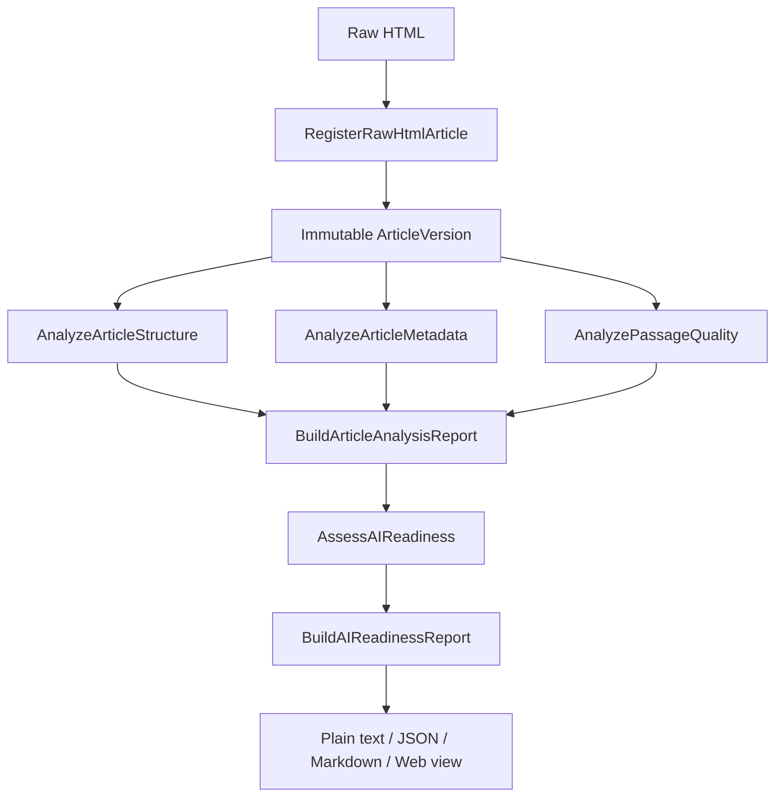

# Architecture

Aether is a deliberately small ports-and-adapters system. The architecture keeps deterministic analysis independent from transport, storage, and presentation concerns.

## Layers

| Layer | Responsibility | May depend on |
| --- | --- | --- |
| Domain | Immutable entities, value objects, invariants, and validation | Standard library and other domain modules |
| Application | Use-case orchestration and immutable analysis results | Domain and port contracts |
| Ports | Interfaces for repositories and external capabilities | Domain types |
| Adapters | HTTP and in-memory implementations of ports | Ports, external libraries, and I/O |
| Presentation | FastAPI routes and report renderers | Application use cases and report types |

The dependency direction is inward. Domain code must not import FastAPI, HTTP clients, templates, or adapters. Application use cases must not know whether a repository is in-memory or persistent. Presentation code may compose use cases, but must not duplicate ingestion or assessment rules.

## Package map

```text
aether/
├── domain/
│   ├── content.py              Article, ArticleVersion, Passage
│   ├── knowledge.py            Claim, Entity, Event, Evidence concepts
│   ├── claim_candidate.py      Immutable curation candidate
│   ├── claim_candidate_evidence.py
│   ├── evaluation.py           Evaluation records and statuses
│   └── policies.py             Domain policies and validation
│   └── source_data.py          What a page declared to machines
├── application/
│   ├── ingestion/              Raw HTML to an immutable article version
│   ├── analysis/               Measurements, and the advice derived from them
│   └── curation/
├── ports/outbound/
├── adapters/outbound/
└── presentation/
    ├── ai_readiness_report_renderers.py
    ├── editor_recommendation_text.py   Wording for each recommendation code
    ├── page_outcome_text.py            Wording for a page that could not be analysed
    └── web/
```

### The analysis layer

Each module measures one thing and returns an immutable result. None of them
decides what to advise.

```text
analyze_article_metadata.py      Which metadata fields the page carries
analyze_article_structure.py     Size of the stored article
analyze_passage_quality.py       Per-paragraph detail
analyze_content_duplication.py   Text shared with the publisher's other articles
analyze_declared_consistency.py  Whether the declared titles and summaries agree
analyze_heading_structure.py     The outline the article declares
analyze_structured_data.py       What the page declares to Schema.org
declared_text_comparison.py      Rules for comparing declared values
build_article_analysis_report.py Composes the above
assess_ai_readiness.py           Metadata completeness classification
derive_editor_recommendations.py Turns measurements into advice
build_ai_readiness_report.py     Projects it all for presentation
```

## Where advice is decided, and where it is worded

`derive_editor_recommendations.py` is the single place a measurement becomes
advice. It emits a recommendation *code*, a category naming who can act on it,
and the supporting facts — never a sentence.

Presentation turns codes into wording. This split keeps copywriting out of use
cases and leaves room for editions in other languages; the editors this
product serves work in Turkish.

Presentation must not decide *whether* a recommendation applies. That would put
a business rule where no test of the application layer can reach it.

## Deterministic rules, and rejected ones

Every rule must produce the same result for the same input, without a threshold
someone chose. Where a comparison is needed, two measured quantities are
compared against each other.

When an obvious approach is rejected for not meeting that bar, the reasoning is
recorded beside the rule that replaced it, so a later reader does not re-propose
it. Current examples live in `declared_text_comparison.py`,
`analyze_heading_structure.py` and `assess_page_content.py`.

## Analysis pipeline



Each analysis consumes stored domain data and returns an immutable result. Assessment derives only the documented deterministic categories; it does not call an AI model and does not produce a numeric score.

## Ingestion contract

`RegisterRawHtmlArticle` turns raw HTML and source metadata into an immutable article version and deterministic passages. The parser is publisher-agnostic. Publication date extraction follows the fixed precedence documented in [`publication-date-extraction.md`](publication-date-extraction.md).

The application layer owns orchestration. HTML parsing and HTTP transport are adapters/capabilities; they must not leak parser objects into domain or report models.

## Presentation contract

Presentation receives an existing `AIReadinessReport` and formats it. The web route may collect input, call the pipeline, and shape display data, but it must not add scoring thresholds, recommendations, extraction rules, or new business decisions. Technical report data remains available behind progressive disclosure in the demonstration UI.

## Testing strategy

- Domain tests verify invariants and immutability.
- Application tests verify each use case and composition boundary.
- Adapter/ingestion tests verify deterministic extraction and malformed input.
- Presentation tests verify renderers, routes, and user-visible workflows.
- Acceptance fixtures exercise a realistic publisher article end to end.

The default CI command is:

```bash
python -m unittest discover -s tests -v
```
