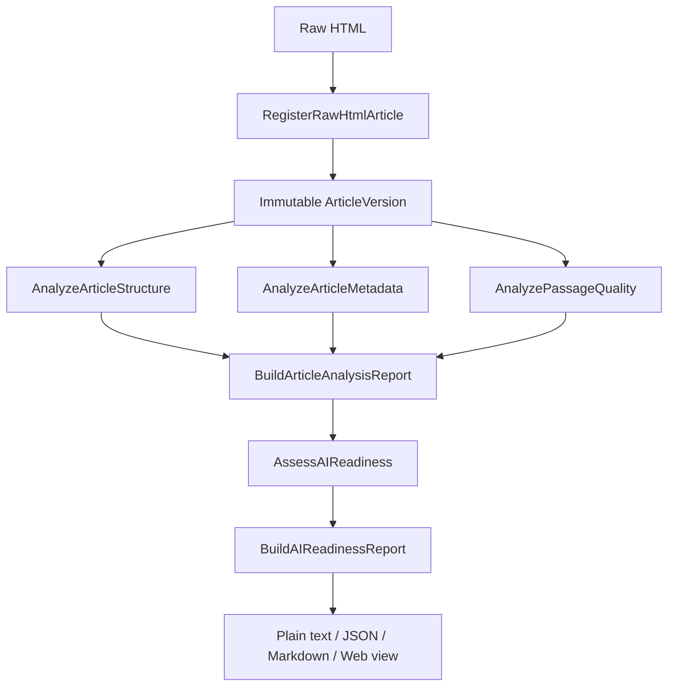

# Architecture

Aether is a deliberately small ports-and-adapters system. The architecture keeps deterministic analysis independent from transport, storage, and presentation concerns.

## Layers

| Layer | Responsibility | May depend on |
| --- | --- | --- |
| Domain | Immutable entities, value objects, invariants, and validation | Standard library and other domain modules |
| Application | Use-case orchestration and immutable analysis results | Domain and port contracts |
| Ports | Interfaces for repositories and external capabilities | Domain types |
| Adapters | HTTP and in-memory implementations of ports | Ports, external libraries, and I/O |
| Presentation | FastAPI routes and report renderers | Application use cases and report types |

The dependency direction is inward. Domain code must not import FastAPI, HTTP clients, templates, or adapters. Application use cases must not know whether a repository is in-memory or persistent. Presentation code may compose use cases, but must not duplicate ingestion or assessment rules.

## Package map

```text
aether/
├── domain/
│   ├── content.py              Article, ArticleVersion, Passage
│   ├── knowledge.py            Claim, Entity, Event, Evidence concepts
│   ├── claim_candidate.py      Immutable curation candidate
│   ├── claim_candidate_evidence.py
│   ├── evaluation.py           Evaluation records and statuses
│   └── policies.py             Domain policies and validation
├── application/
│   ├── ingestion/
│   ├── analysis/
│   └── curation/
├── ports/outbound/
├── adapters/outbound/
└── presentation/
    ├── ai_readiness_report_renderers.py
    └── web/
```

## Analysis pipeline



Each analysis consumes stored domain data and returns an immutable result. Assessment derives only the documented deterministic categories; it does not call an AI model and does not produce a numeric score.

## Ingestion contract

`RegisterRawHtmlArticle` turns raw HTML and source metadata into an immutable article version and deterministic passages. The parser is publisher-agnostic. Publication date extraction follows the fixed precedence documented in [`publication-date-extraction.md`](publication-date-extraction.md).

The application layer owns orchestration. HTML parsing and HTTP transport are adapters/capabilities; they must not leak parser objects into domain or report models.

## Presentation contract

Presentation receives an existing `AIReadinessReport` and formats it. The web route may collect input, call the pipeline, and shape display data, but it must not add scoring thresholds, recommendations, extraction rules, or new business decisions. Technical report data remains available behind progressive disclosure in the demonstration UI.

## Testing strategy

- Domain tests verify invariants and immutability.
- Application tests verify each use case and composition boundary.
- Adapter/ingestion tests verify deterministic extraction and malformed input.
- Presentation tests verify renderers, routes, and user-visible workflows.
- Acceptance fixtures exercise a realistic publisher article end to end.

The default CI command is:

```bash
python -m unittest discover -s tests -v
```
